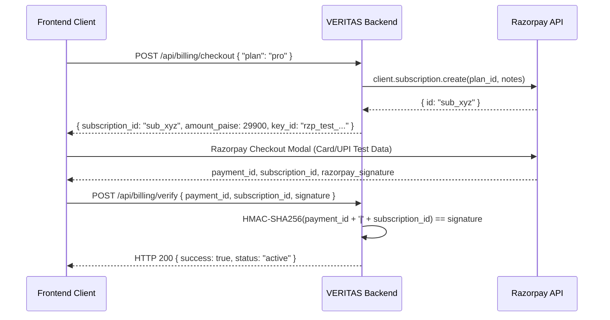

# Razorpay Test Mode Setup & Webhook Guide

This guide details configuring and testing Razorpay Test Mode subscriptions and webhooks for VERITAS AI.

---

## 1. Prerequisites & Credentials

1. Sign up for a [Razorpay Account](https://dashboard.razorpay.com/).
2. Toggle the dashboard to **Test Mode** (orange badge in top navigation).
3. Navigate to **Settings** > **API Keys** > **Generate Test Key**.
4. Retrieve:
   - `Key ID` (e.g., `rzp_test_...`)
   - `Key Secret`
5. Place these values in `backend/.env`:
   ```bash
   RAZORPAY_KEY_ID=rzp_test_YourKeyId
   RAZORPAY_KEY_SECRET=YourKeySecret
   RAZORPAY_WEBHOOK_SECRET=YourWebhookSecret
   ```

---

## 2. Creating Recurring Subscription Plans in Razorpay

Create two plans in the Razorpay Dashboard under **Subscriptions** > **Plans** > **Create Plan** (or via the Plans API):

### Standard Plan
- **Plan Name:** `VERITAS AI Standard Plan`
- **Billing Period:** `Monthly`
- **Interval:** `1`
- **Amount:** `199` INR (`19900` paise)
- Note the generated Plan ID (e.g., `plan_N3v8...`) and set:
  ```bash
  RAZORPAY_STANDARD_PLAN_ID=plan_N3v8...
  ```

### Pro Plan
- **Plan Name:** `VERITAS AI Pro Plan`
- **Billing Period:** `Monthly`
- **Interval:** `1`
- **Amount:** `299` INR (`29900` paise)
- Note the generated Plan ID (e.g., `plan_N3w9...`) and set:
  ```bash
  RAZORPAY_PRO_PLAN_ID=plan_N3w9...
  ```

---

## 3. Subscription Checkout Flow



### Signature Verification Details
- **Formula:** `HMAC-SHA256(razorpay_payment_id + "|" + razorpay_subscription_id, RAZORPAY_KEY_SECRET)`
- Handled securely with `hmac.compare_digest` in `backend/app/services/razorpay_service.py` to prevent timing attacks.

---

## 4. Webhook Setup & Configuration

Razorpay delivers asynchronous events regarding subscription recurring debits, authentications, and payment failures.

### 4.1 Configuring the Webhook in Razorpay Dashboard
1. Go to **Settings** > **Webhooks** > **Add New Webhook**.
2. **Webhook URL:** `https://your-domain.com/api/webhooks/razorpay` (or your ngrok URL for local development).
3. **Secret:** Set a secure random string (matches `RAZORPAY_WEBHOOK_SECRET`).
4. **Active Events to Subscribe:**
   - `subscription.authenticated`
   - `subscription.activated`
   - `subscription.charged`
   - `subscription.halted`
   - `subscription.cancelled`
   - `subscription.completed`
   - `payment.failed`

---

## 5. Local Webhook Testing via ngrok & curl

### Step 1: Start Backend Server
```bash
cd backend
.venv\Scripts\uvicorn app.main:app --port 8000 --reload
```

### Step 2: Tunnel via ngrok
```bash
ngrok http 8000
```
Copy the forwarding HTTPS URL (e.g., `https://abcdef123.ngrok-free.app`) and append `/api/webhooks/razorpay`.

### Step 3: Trigger a Simulated Webhook via Python / curl
You can generate valid HMAC-SHA256 signed payloads with this Python script:

```python
import hmac, hashlib, json, requests

secret = "YourWebhookSecret"
payload = {
    "id": "evt_test_123456",
    "entity": "event",
    "event": "subscription.charged",
    "payload": {
        "subscription": {
            "entity": {
                "id": "sub_xyz",
                "status": "active",
                "current_start": 1700000000,
                "current_end": 1702592000
            }
        }
    }
}
body = json.dumps(payload).encode("utf-8")
sig = hmac.new(secret.encode("utf-8"), body, hashlib.sha256).hexdigest()

res = requests.post(
    "http://localhost:8000/api/webhooks/razorpay",
    data=body,
    headers={
        "Content-Type": "application/json",
        "X-Razorpay-Signature": sig
    }
)
print("Status:", res.status_code, "Body:", res.json())
```

---

## 6. Idempotency & Deduplication Guarantees

- Every incoming webhook event ID (`event["id"]`) is checked against the `payment_events` table in SQLite.
- If the event was previously recorded, the handler immediately returns:
  ```json
  {
    "status": "ignored",
    "message": "Event already processed (idempotent duplicate).",
    "provider_event_id": "evt_test_123456"
  }
  ```
- This prevents race conditions and repeated billing updates when Razorpay retries webhook deliveries.

